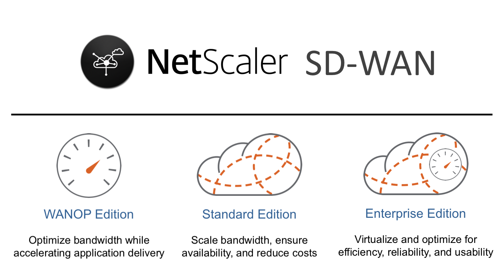

# [NetScaler SD WAN](https://www.citrix.com/products/netscaler-sd-wan/)

NetScaler SD-WAN, offers a scalable, reliable, and cloud-ready approach to ensure optimized and continuous WAN connectivity across all business sites. NetScaler SD-WAN combines packet-level, real-time path selection, WAN optimization, firewall, routing, and application analytics into one comprehensive solution. Whether accessing SaaS applications, virtualized desktops, or traditional data centers, NetScaler SD-WAN ensures an always-on, high-quality experience and a simpler, more agile branch network.

View the platforms and functional data sheet to compare the various offerings with Citrix's NetScaler SD WAN. [Click here](https://www.citrix.com/products/netscaler-sd-wan/platforms.html) to view.

# Overview 

This repository serves to index and allows for navigation through the growing content specifically focused on NetScaler SD WAN solutions within the [Citrix-TechSpecialist](https://github.com/Citrix-TechSpecialist) Github organization. Here you can find tutorials, reference guides and auxiliary tools to better accustom yourself with NetScaler ADC and how to manage and administer the networking appliance. 

# Index

Here is a manually updated list every time a new repository or collateral is published for quick navigation to relevant material. 

## Standard Edition

**[NetScaler-SDWAN-SE-101](https://github.com/Citrix-TechSpecialist/NetScaler-SDWAN-SE-101)**

This repository serves as a guide to help prospective customers and partners successfully use available components in [Citrix Demo Center](demo.citrix.com) to deliver an effective NetScaler SD-WAN demonstration. The NetScaler SD-WAN demo is a simple approach to show customers some of the latest capabilities of the Citrix SD-WAN solution using an environment that has already been configured and validated for you.
